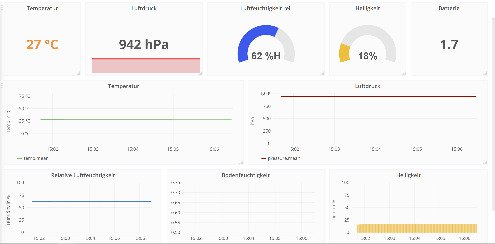

# Grafana Installation & Konfiguration (Ubuntu/Debian)
Visualisierungstool für Datenanalyse und Monitoring von z.B. Sensordaten
## Installation
### Step 1: Herunterladen und Dependencies installieren
```bash
wget https://s3-us-west-2.amazonaws.com/grafana-releases/release/grafana_4.4.2_amd64.deb

sudo apt-get install -y adduser libfontconfig
```

### Step 2: Installieren
```bash
sudo dpkg -i grafana_4.4.2_amd64.deb
```

### Step 3: Server starten
```bash
sudo service grafana-server start
```
## Konfiguration

### Datenbank hinterlegen
1. In Navigation auf Data Sources
2. Add Data Sources
3. Alle Daten eingeben, fertig
### Measurement einem Graph zuweisen
1. Im Dashboard neuen Graph hinzufügen
2. Edit > Metrics
3. Panel Data Sources -> Datenbank auswählen
4. Bei Select richtigen Messwert hinterlegen

